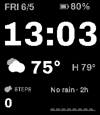
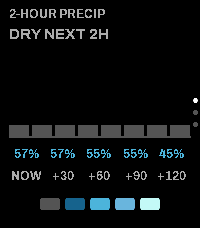
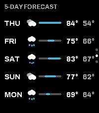
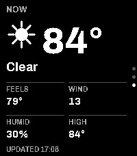

# PebbleSky

A weather watchface for the **Pebble Time 2**, with hyperlocal precipitation at
its heart — plus a companion app for detailed forecasts. Built in C on
[PebbleOS](https://github.com/coredevices/pebbleos).

<p>
  
  
  
  
</p>

## Features

**Watchface** — glanceable, themeable, always-on:
- Big steady clock (12/24h), date, battery, and step count
- Current temperature, today's high, and a condition icon (12-glyph set)
- **A 2-hour hyperlocal precipitation strip** + a live **"rain in N min"**
  countdown — the headline feature
- A "stale" cue when the phone hasn't refreshed the forecast recently

**Companion app** (`PebbleSky Detail`) — opened via Quick Launch, cycled with
**Up/Down** (Back exits):
1. **2-hour precip detail** — bars, countdown, probability, intensity scale
2. **5-day forecast** — per-day icon + hi/lo range bars
3. **Now** — temperature, feels-like, wind, humidity, last-updated

**Configurable** (via [Clay](https://github.com/pebble-dev/clay)):
- Weather provider: **Open-Meteo** (free, no key) or **Tomorrow.io** (API key)
- Units (°F/°C), clock (12/24h), date order (M/D · D/M)
- Accent and rain-warning colors

## How the precip countdown stays accurate

A 2-hour nowcast goes stale fast if you just freeze it at fetch time. Instead,
the phone over-fetches a **4-hour buffer** of 15-minute precip buckets plus an
**anchor timestamp**, and the watch **slides a 2-hour window** over that buffer
**every minute**, recomputing the "now" marker and the countdown against the
real clock. So `RAIN IN 20M` ticks down to `5M` on its own, with no new fetch;
the underlying forecast refreshes about every 30 minutes.

## Layout

```
src/c/PebbleSky.c           the watchface
src/pkjs/                    watchface PebbleKit JS (weather + Clay config)
shared/pebblesky_render.h    shared icon set + precip bars (used by both apps)
companion/                   the companion watchapp (its own project)
resources/fonts/             Archivo (OFL)
design/                      the original design handoff
```

The watchface and companion are **two separate Pebble apps** (a watchface can't
take button input, so the detail screens live in a button-driven app). They each
fetch their own forecast and are configured independently.

## Build

Requires the [Pebble SDK / pebble-tool](https://developer.repebble.com).
Targets **emery** (Pebble Time 2).

```sh
# watchface
pebble build

# companion
cd companion && pebble package install @rebble/clay && pebble build
```

Preview in the emulator:

```sh
pebble install --emulator emery
pebble screenshot
```

## Install on a watch

Build each project, then sideload the resulting `.pbw` (in `build/`) through the
Pebble/Core app on your phone. Set the watchface active, and bind **Quick Launch**
(long-press Up or Down) to `PebbleSky Detail` to open the companion from the face.

## Configure

In the Pebble/Core app, open each app's **Settings** to reach its Clay config
page. For Tomorrow.io, select it as the provider and paste your API key.
(The two apps don't share settings, so set them in both if you want parity.)

## Credits

- Type: [Archivo](https://github.com/Omnibus-Type/Archivo) by Omnibus-Type (OFL)
- Weather: [Open-Meteo](https://open-meteo.com) · [Tomorrow.io](https://www.tomorrow.io)
- Config: [Clay](https://github.com/pebble-dev/clay)
- Built on [PebbleOS](https://github.com/coredevices/pebbleos) /
  [pebble-tool](https://developer.repebble.com)

## License

[MIT](LICENSE) © Dave Bortz
